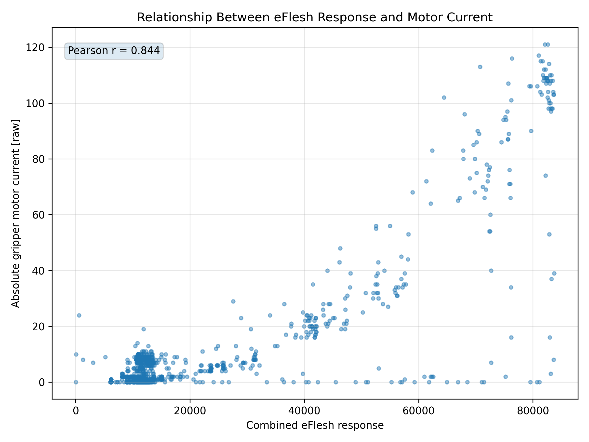
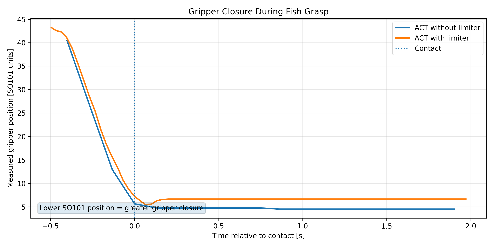
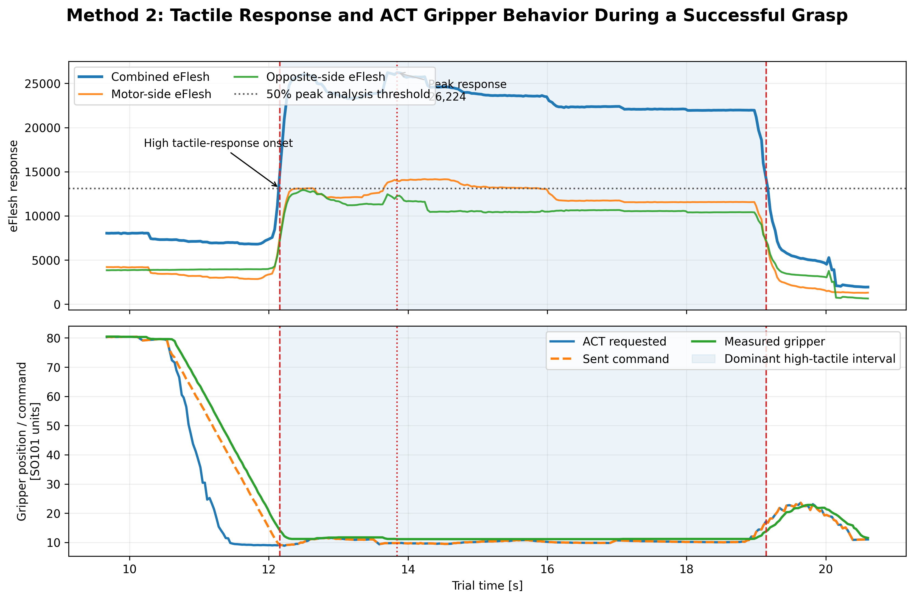
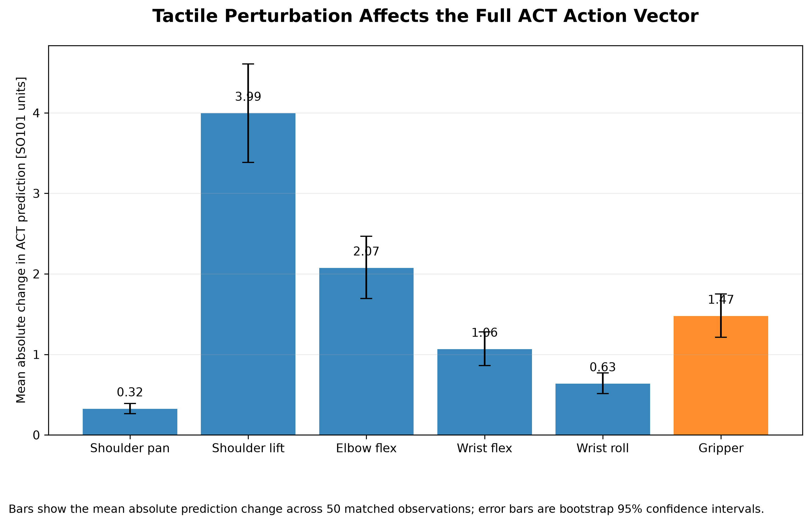

# Learning from Demonstrations

**Tactile-informed soft-object manipulation using SO-101, eFlesh, and ACT**

This project investigates two ways of using tactile information in learning-from-demonstration manipulation of a deformable object.

- **Method 1 — tactile-calibrated safety layer:** eFlesh is used during calibration to identify deformation-related behavior. The learned ACT gripper command is then constrained using gripper position and motor-current feedback.
- **Method 2 — direct tactile integration:** the complete 30-channel eFlesh signal is appended to the ACT observation so the policy can directly respond to tactile input.

The repository contains the analysis data, execution scripts, quantitative results, and figures used in the final project.

## System

The platform uses an SO-101 leader/follower setup, two RGB cameras, and two eFlesh tactile surfaces. Each eFlesh surface contains five 3-axis magnetometers, giving 15 channels per surface and **30 tactile channels total**.

For Method 2, the ACT state contains 6 robot-state values + 30 tactile values = **36 dimensions**. The policy predicts a 6-dimensional robot action.

> eFlesh values are baseline-relative magnetic responses, not calibrated force measurements.

## Method 1 — Tactile-Calibrated Safety Layer

Calibration synchronized eFlesh response with gripper position and motor-current telemetry. The measured eFlesh/current relationship was **Pearson r = 0.844**.



The runtime safety layer used a contact-search position of 12 SO-101 units, contact-current threshold of 6 raw units, allowed post-contact closure of 1 SO-101 unit, current-relief threshold of 9 raw units, current-relief release threshold of 6 raw units, and reset/opening margin of 5 SO-101 units.

The baseline execution reached a peak post-interaction current of **24 raw units**, while the limited execution reached **16 raw units**, a **33.3% reduction**. During the analyzed contact interval, the safety layer modified the ACT gripper command by a mean of **3.422 SO-101 units** and a maximum of **5.751 units**.



## Method 2 — Direct Tactile Integration

Method 2 adds all 30 signed baseline-relative tactile channels directly to ACT.

Dataset:
- 50 episodes
- 35,458 frames
- 2 cameras
- 36-dimensional state
- 6-dimensional action
- task: `Grab the fish smoothly`

Public Hugging Face dataset:

`Cookieman12/grab_fish_eflesh_act_v1`

Public ACT model:

`Cookieman12/grab_fish_eflesh_act_v1_50k`

The policy was trained for 50,000 steps with batch size 8.

A successful rollout produced a dominant high-tactile interval from **12.156 s to 19.140 s**, with peak tactile response at **13.841 s**.



During the analyzed initial high-tactile interval, the policy gripper command and transmitted gripper command were identical. The Method 1 eFlesh-derived safety override was not active during this interval.

## Tactile-Input Sensitivity Ablation

A matched-input ablation tested whether ACT actually used the tactile channels. For each of the 50 episodes, a high-tactile observation was compared with a matched lower-tactile replacement while keeping the target camera observations and robot state fixed as closely as possible.

| Metric | Result |
|---|---:|
| Tested observations | 50 |
| Median tactile contrast | 3.31x |
| Mean absolute gripper change | 1.475 SO-101 units |
| Median absolute gripper change | 1.302 |
| 90th percentile | 2.993 |
| Maximum | 3.793 |
| Mean signed gripper change | -1.334 |
| Real tactile -> more closure | 42/50 |
| Real tactile -> less closure | 8/50 |
| Correlation between tactile contrast and absolute gripper change | r = 0.427 |



These results show that the trained ACT output is sensitive to tactile input. They do **not** by themselves prove that Method 2 is safer or reduces deformation.

## Repository Structure

```text
data/
  method1/
  method2/
figures/
  method1/
  method2/
  expanded_results/
results/
  method2_ablation/
scripts/
  common/
  method1/
  method2/
README.md
requirements.txt
```

## Reproducing the Analysis

### Method 1

```bash
python scripts/method1/generate_method1_figures.py
```

### Method 1 / Method 2 comparison figures

```bash
python scripts/common/generate_expanded_results_figures.py
```

### Full Method 2 tactile ablation

The full ablation requires the public Hugging Face dataset and ACT model and was validated with **LeRobot 0.6.1, Python 3.12, and CUDA**.

```bash
python scripts/method2/run_matched_tactile_ablation.py
```

Output:

`results/method2_ablation/matched_tactile_ablation.csv`

The reproduced CSV was verified to be **bit-for-bit identical** to the final analysis CSV.

SHA-256:

`edce86cd969ca2731a5b15d4cbffc23a7fc16337a5e9583ac4d46fc992691a1a`

Ablation figures can then be generated with:

```bash
python scripts/method2/generate_ablation_figures.py
```

## Limitations

This project is an experimental comparison rather than a statistically powered manipulation benchmark.

- eFlesh response was not calibrated into force units.
- Method 1 and Method 2 were not evaluated as a controlled A/B experiment under identical hardware conditions.
- The successful Method 2 rollout demonstrates feasibility, not a statistically meaningful success rate.
- Tactile sensitivity does not itself prove reduced deformation or improved safety.
- Additional trials, objects, demonstrations, and controlled deformation measurements would be required to establish generalization.

## Main Conclusion

Method 1 demonstrates how tactile sensing can be translated into an explicit external constraint on a learned controller. Method 2 demonstrates that tactile sensing can instead be supplied directly to ACT as part of the observation and measurably affect the learned policy output.

Together, the two approaches illustrate two practical ways of incorporating tactile information into learning-from-demonstration manipulation.
